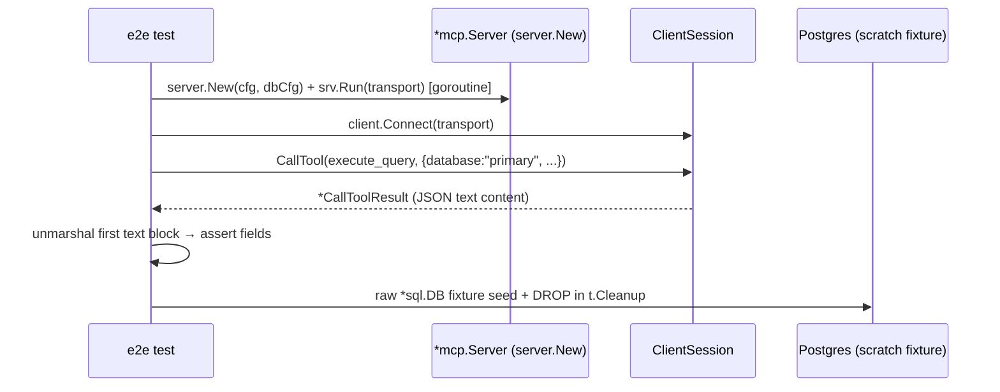

# Replace integration tests with e2e

> Delete the dialect-level integration tests and replace them with one in-process e2e package that drives the real `*mcp.Server` through the SDK's in-memory transport, covering the full client → tool → registry → dialect → Postgres path.

## Context

The dialect-level integration tests in `internal/db/postgres/integration_test.go` call `Dialect` methods directly, bypassing the MCP server, tool handlers, and registry resolution. They verify the dialect but not the path a client actually uses. A regression in `server.New`, tool registration, alias resolution, or the handler→dialect contract would slip past them. An end-to-end test that drives the real `*mcp.Server` through the SDK client covers the whole stack with the same effort and fewer tests to maintain.

The go-sdk (`github.com/modelcontextprotocol/go-sdk` v1.7.0) exposes `mcp.NewInMemoryTransports()`, returning two transports backed by `net.Pipe` — one for the client, one for the server. The server runs via `*mcp.Server.Run(ctx, transport)`; a client session is created with `client.Connect(ctx, transport, opts)` and tool calls go through `ClientSession.CallTool(ctx, &CallToolParams{Name, Arguments})`, returning `*CallToolResult` whose `Content` holds the structured output as JSON text. `server.New` already builds a fully wired `*mcp.Server` + `*db.Registry` from a `*config.Config` and `*db.Config`, so the e2e harness reuses it directly with a real-Postgres config.

## Goals
- One e2e test package exercising server → tool registration → registry resolution → dialect → real Postgres through the MCP `tools/call` boundary.
- Same DB guard as before: skip on unset `SQLDB_MCP_TEST_POSTGRES_URL`, auto-load repo-root `.env`.
- Keep the golang-unit-test table-driven shape for the per-tool scenarios.

## Non-goals
- Subprocess or real-stdio/HTTP transport testing. The e2e client uses the SDK in-memory transport (`mcp.NewInMemoryTransports`); `main()` flag/transport wiring is covered by existing unit/manual paths, not here.
- Real transport (stdio/HTTP) or subprocess tests.
- Removing or altering the unit tests (`internal/db`, `internal/config`, `internal/tools`, postgres builder golden tests) — those stay.
- Touching production code unless a wiring defect surfaces.
- Dropping the unit/builder tests.
- Testing engines other than Postgres.

## Flow

## Decisions

### D1: In-memory transport, not subprocess

Use `mcp.NewInMemoryTransports()`: hand one end to `srv.Run` in a goroutine, the other to `client.Connect`. The server is built by `server.New`, so registration/Instructions/registry lifecycle are real — only the OS transport is virtual.

- **Why over subprocess+stdio:** deterministic, no process teardown races, no JSON-RPC-over-pipes parsing on our side; still exercises the full in-process tool→DB path the integration tests missed.
- **What it does NOT cover:** `main.go` flag parsing and the stdio/HTTP transport selection. That wiring is thin and unchanged; left to manual/`run` checks.

### D2: Build the server with a real Postgres `db.Config`

The harness constructs a `db.Config` from `SQLDB_MCP_TEST_POSTGRES_URL` (alias `primary`, `driver: postgres`, plus a scratch schema fixture for deterministic object names), calls `server.New(&config.Config{...}, &dbCfg, logger)`, and holds the returned registry for `Close` in cleanup. The fixture (scratch schema `sqldb_mcp_test`, table `t_item`, seeded rows) is created over the same DSN with a raw `*sql.DB` and dropped in `t.Cleanup` — mirroring the deleted integration setup.

- **Config values:** use a small `row_limit` (e.g. 10) and seed >limit rows so the row-cap scenario is observable through `execute_query`'s returned row count without needing 250 rows.

### D3: Assert on the structured `tools/call` result

Typed handlers serialize their `Out` struct as JSON text content. The harness unmarshals the first text content block into the matching tool output struct (e.g. `tools.ExecuteQueryOutput`) and asserts fields. Error paths assert `CallToolResult.IsError` (or a non-nil `CallTool` error) and the error text.

- **Why parse JSON not raw text:** keeps assertions on structured fields (column names, row counts, plan output) and matches how a real client consumes results.

### D4: Relocate the `.env` loader

The `.env` loader currently lives in `internal/db/postgres/testenv_test.go`. Since that package's integration tests are deleted, move the loader into the e2e test package so `go test ./tests/e2e/...` works without a manual `export`. Same semantics: keys not already set, quotes stripped, walk up to repo root.

## Risks / Trade-offs
- **In-memory transport hides transport bugs** → accepted; transport is thin SDK plumbing, and the conformance/SDK tests cover it. D1 notes the gap explicitly.
- **Server `Run` goroutine lifecycle** → the harness must cancel the context (and let `Run` return) before the test exits; `t.Cleanup` cancels and the registry `Close` follows. If `Run` leaks, `go test -race` will surface it.
- **Fixture collisions on parallel runs** → the scratch schema name is fixed (`sqldb_mcp_test`); tests must not run `-parallel` against the same DB. Documented; the suite is not parallel.

## Testing

### Scenario

| Given | When | Then |
|-------|------|------|
| `SQLDB_MCP_TEST_POSTGRES_URL` unset | e2e suite runs | `t.Skip` with a clear message |
| server built with alias `primary` (postgres, readonly) | `list_databases` called | returns `primary`; no `url`/credential in serialized result |
| scratch fixture present | `list_objects` called | scratch table present (type `table`); unsupported `type` returns an error result |
| scratch fixture present | `get_object_details` called | columns (id not-null), a primary-key constraint, at least one index |
| seeded rows | `execute_query` read | `SELECT` returns seeded rows; bind-param query (`WHERE id = $1`) returns exactly the bound row |
| configured small `row_limit`, query matches more rows | `execute_query` read | returns at most `row_limit` rows |
| `readonly: true`, `DELETE` | `execute_query` | error result containing the read-only message; table row count unchanged |
| scratch fixture present | `explain_query` | text plan non-empty; `format: json` parses as JSON; `analyze: true` returns a plan under the read-only tx |

## Migration Plan

1. Add `tests/e2e` package: bootstrap helper (server+client+fixture) and `.env` loader.
2. Port each integration scenario to a `tools/call`-driven table test.
3. Delete `internal/db/postgres/integration_test.go` and `testenv_test.go`.
4. `go test ./...` — unit + e2e green; e2e skips when the DSN is unset.
5. Rollback = revert; the deleted integration tests return and the e2e package is gone.

## Open Questions
- None — approach (in-memory client), DB guard, and scope (remove integration tests, keep units) are settled.

## Todo

### 1. E2E harness — `tests/e2e`
- [x] 1.1 Create `tests/e2e` package with a `.env` loader (relocated from `internal/db/postgres/testenv_test.go`): walk up to repo root, parse `KEY=VALUE`/`KEY='VALUE'`, strip quotes, set env only when unset
- [x] 1.2 Add a DSN helper: load `.env`, read `SQLDB_MCP_TEST_POSTGRES_URL`, `t.Skip` with a clear message when unset
- [x] 1.3 Add a fixture helper: open a raw `*sql.DB` over the DSN, idempotently create scratch schema `sqldb_mcp_test` + `t_item(id INT PK, label TEXT NOT NULL DEFAULT 'x')`, seed N rows, `DROP SCHEMA ... CASCADE` in `t.Cleanup`
- [x] 1.4 Add a server+client bootstrap helper: build `db.Config` (alias `primary`, `driver: postgres`, small `row_limit`) from the DSN, call `server.New`, wire `mcp.NewInMemoryTransports`, run `srv.Run` in a goroutine, `client.Connect`, return `(*mcp.ClientSession, cleanup)`; cleanup cancels context, waits `Run`, and `reg.Close()`
- [x] 1.5 Add a `callTool` helper wrapping `ClientSession.CallTool` that returns the first text content block (for JSON parsing) and surfaces `IsError`/error

### 2. E2E scenarios (table-driven, `tools/call` boundary)
- [x] 2.1 `list_databases`: returns `primary` (postgres, readonly); assert no `url`/credential in the serialized result
- [x] 2.2 `list_objects`: scratch table present (type `table`); unsupported `type` returns an error result
- [x] 2.3 `get_object_details`: columns (id not-null), a primary-key constraint, at least one index
- [x] 2.4 `execute_query` read: `SELECT` returns seeded rows; bind-param query (`WHERE id = $1`) returns exactly the bound row
- [x] 2.5 `execute_query` row-cap: with the configured small `row_limit`, a query matching more rows returns at most that many
- [x] 2.6 `execute_query` rejected write: under `readonly: true`, `DELETE` returns an error result containing the read-only message; assert the table row count is unchanged
- [x] 2.7 `explain_query`: text plan non-empty; `format: json` output parses as JSON; `analyze: true` returns a plan under the read-only tx

### 3. Removal + cleanup
- [x] 3.1 Delete `internal/db/postgres/integration_test.go`
- [x] 3.2 Delete `internal/db/postgres/testenv_test.go` (loader relocated to `tests/e2e`)
- [x] 3.3 Run `go test ./...` — unit tests pass, e2e passes against the real DB (or skips when DSN unset); `go vet ./...` clean
- [x] 3.4 Update `README.md` test section: integration-test reference → e2e test reference (`go test ./tests/e2e/...`, same `SQLDB_MCP_TEST_POSTGRES_URL` guard)
